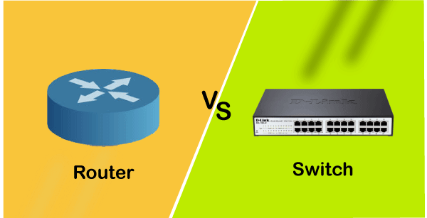

# NetPractice

## Table of Contents

- [Introduction](#introduction)
- [Key Networking Concepts](#key-networking-concepts)
  - [What is a Network?](#what-is-a-network)
  - [Routers vs. Switches](#routers-vs-switches)
  - [IP Addresses vs. MAC Addresses](#ip-addresses-vs-mac-addresses)
  - [TCP/IP Model vs. OSI Model](#tcpip-model-vs-osi-model)
  - [Public and Private IP Addresses](#public-and-private-ip-addresses)
  - [Subnetting and Subnet Masks](#subnetting-and-subnet-masks)
- [Levels](#levels)

---

## Introduction

NetPractice is a project designed to teach networking concepts through practical exercises. This guide explores fundamental networking principles and provides an overview of essential tools, including routers, switches, IP addressing, and network models.

  <b><a href="#top">↥ back to top</a></b>

---

## Key Networking Concepts

### What is a Network?

A network is a collection of interconnected devices which we call "Hosts" (e.g., computers, servers, printers) that share resources and communicate with one another. Networks consist of several key components:

- **Devices**: Endpoints like computers, phones, and IoT gadgets.
- **Links**: Wired or wireless connections facilitating data transfer.
- **Protocols**: Rules that define how data is transmitted and received.

  <b><a href="#top">↥ back to top</a></b>

---

### Routers vs. Switches

- **Router**: A device that connects multiple networks and forwards data packets based on their IP addresses. Routers enable communication between local networks and the internet.
- **Switch**: A device that connects multiple devices within a single network, forwarding data based on MAC addresses.

**Difference**:
- Routers operate at the network layer (Layer 3 - packets) and handle IP addresses , while switches operate at the data link layer (Layer 2 - frames) and handle MAC addresses.
- Routers can connect to external networks, whereas switches work within a single network.

  <b><a href="#top">↥ back to top</a></b>

---

### IP Addresses vs. MAC Addresses

- **IP Address**: A logical address assigned to devices for network identification. It changes based on the network connection.
- **MAC Address**: A physical, permanent address unique to each device's network interface card (NIC).

**Key Differences**:
- IP addresses are hierarchical and used for routing across networks.
- MAC addresses are flat and used for communication within a local network.

  <b><a href="#top">↥ back to top</a></b>

---

### TCP/IP Model vs. OSI Model

- **TCP/IP Model**: A four-layer framework (Application, Transport, Internet, Network Interface) designed for practical internet communication.
- **OSI Model**: A seven-layer model (Application, Presentation, Session, Transport, Network, Data Link, Physical) used for theoretical understanding of network processes.

**Key Differences**:
- The OSI model is more granular and conceptual, while the TCP/IP model focuses on real-world protocols and applications.
- TCP/IP merges some OSI layers for simplicity.

  <b><a href="#top">↥ back to top</a></b>

---

### Public and Private IP Addresses

- **Public IP Address**: Used to identify devices across the internet, assigned by Internet Service Providers (ISPs).
- **Private IP Address**: Used within local networks for internal communication, not routable on the internet.

**Key Differences**:
- Public IPs allow devices to communicate outside their local network.
- Private IPs are reserved for internal use and must be translated via NAT to connect to the internet.

**Private IP Ranges**:
- 192.168.0.0 – 192.168.255.255
- 172.16.0.0 – 172.31.255.255
- 10.0.0.0 – 10.255.255.255

  <b><a href="#top">↥ back to top</a></b>

---

### Subnetting and Subnet Masks

- **Subnetting**: The process of dividing a larger network into smaller, more manageable subnetworks. It helps improve network performance, organization, and security.
- **Subnet Mask**: A 32-bit number that separates the network and host portions of an IP address.

**Example**:
For the IP address `192.168.1.10` with a subnet mask `255.255.255.0`:
- The network portion is `192.168.1.0`.
- The host portion is `.10`.

**Benefits of Subnetting**:
- Efficient use of IP addresses.
- Reduced network congestion.
- Enhanced security by isolating subnets.

**CIDR Notation**:
Subnet masks can also be represented using Classless Inter-Domain Routing (CIDR) notation. For example, `/24` represents `255.255.255.0`.

**Subnetting Example**:
If you have a network `192.168.1.0/24`, splitting it into two subnets would result in:
- Subnet 1: `192.168.1.0/25` (hosts: `192.168.1.1` to `192.168.1.126`)
- Subnet 2: `192.168.1.128/25` (hosts: `192.168.1.129` to `192.168.1.254`)

  <b><a href="#top">↥ back to top</a></b>

---

### Levels

This section provides a breakdown of exercises and challenges to help you apply networking concepts in a hands-on manner. Each level introduces new scenarios involving devices, IP configurations, and routing.

  
Level 1

   
    
   
   

---

  
Level 2

   
    
   
   

---

  
Level 3

   
    
   
   

---

  
Level 4

   
    
   
   

---

  
Level 5

   
    
   
   

---

  
Level 6

   
    
   
   

---

  
Level 7

   
    
   
   

---

  
Level 8

   
    
   
   

---

  
Level 9

   
    
   
   

---

  
Level 10

   
    
   
   

