# NetPractice

## Table of Contents

- [Introduction](#introduction)
- [Key Networking Concepts](#key-networking-concepts)
  - [What is a Network?](#what-is-a-network)
  - [Routers vs. Switches](#routers-vs-switches)
  - [IP Addresses vs. MAC Addresses](#ip-addresses-vs-mac-addresses)
  - [TCP/IP Model vs. OSI Model](#tcpip-model-vs-osi-model)
  - [Public and Private IP Addresses](#public-and-private-ip-addresses)
  - [Subnetting and Subnet Masks](#subnetting-and-subnet-masks)
- [Levels](#levels)

---

## Introduction

NetPractice is a project designed to teach networking concepts through practical exercises. This guide explores fundamental networking principles and provides an overview of essential tools, including routers, switches, IP addressing, and network models.

  <b><a href="#top">↥ back to top</a></b>

---

## Key Networking Concepts

### What is a Network?

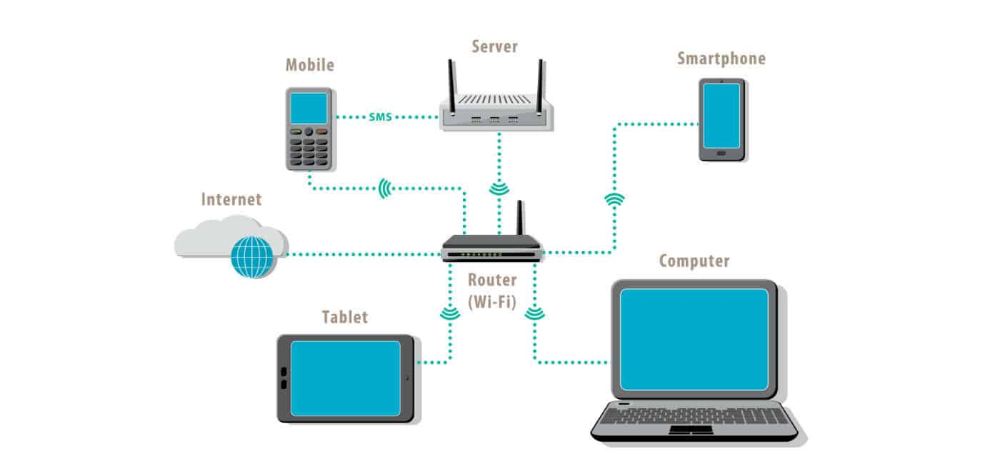

A network is a collection of interconnected devices which we call "Hosts" (e.g., computers, servers, printers) that share resources and communicate with one another. Networks consist of several key components:

- **Devices**: Endpoints like computers, phones, and IoT gadgets.
- **Links**: Wired or wireless connections facilitating data transfer.
- **Protocols**: Rules that define how data is transmitted and received.

  <b><a href="#top">↥ back to top</a></b>

---

### Routers vs. Switches

- **Router**: A device that connects multiple networks and forwards data packets based on their IP addresses. Routers enable communication between local networks and the internet.
- **Switch**: A device that connects multiple devices within a single network, forwarding data based on MAC addresses.

**Difference**:
- Routers operate at the network layer (Layer 3 - packets) and handle IP addresses , while switches operate at the data link layer (Layer 2 - frames) and handle MAC addresses.
- Routers can connect to external networks, whereas switches work within a single network.

**Routing Tables and MAC Tables**:

- **Routing Tables**: Routers use routing tables to determine the best path for forwarding packets to their destination. These tables store information about network paths and associated metrics, enabling efficient inter-network communication.
- **MAC Tables**: Switches maintain MAC tables to map device MAC addresses to specific switch ports. This mapping allows switches to forward data within a local network to the correct destination efficiently.

  <b><a href="#top">↥ back to top</a></b>

---

### IP Addresses vs. MAC Addresses

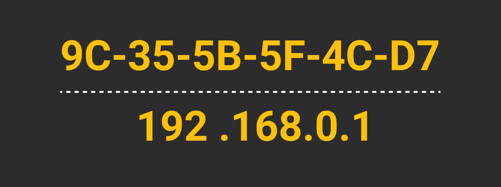

- **IP Address**: A logical address assigned to devices for network identification. It changes based on the network connection.
- **MAC Address**: A physical, permanent address unique to each device's network interface card (NIC).

**Key Differences**:
- IP addresses are hierarchical and used for routing across networks.
- MAC addresses are flat and used for communication within a local network.

  <b><a href="#top">↥ back to top</a></b>

---

### TCP/IP Model vs. OSI Model

- **TCP/IP Model**: A four-layer framework (Application, Transport, Internet, Network Interface) designed for practical internet communication.
- **OSI Model**: A seven-layer model (Application, Presentation, Session, Transport, Network, Data Link, Physical) used for theoretical understanding of network processes.

**Key Differences**:
- The OSI model is more granular and conceptual, while the TCP/IP model focuses on real-world protocols and applications.
- TCP/IP merges some OSI layers for simplicity.

  <b><a href="#top">↥ back to top</a></b>

---

### Public and Private IP Addresses

- **Public IP Address**: Used to identify devices across the internet, assigned by Internet Service Providers (ISPs).
- **Private IP Address**: Used within local networks for internal communication, not routable on the internet.

**Key Differences**:
- Public IPs allow devices to communicate outside their local network.
- Private IPs are reserved for internal use and must be translated via NAT to connect to the internet.

**Private IP Ranges**:
- 192.168.0.0 – 192.168.255.255
- 172.16.0.0 – 172.31.255.255
- 10.0.0.0 – 10.255.255.255

  <b><a href="#top">↥ back to top</a></b>

---

### Subnetting and Subnet Masks

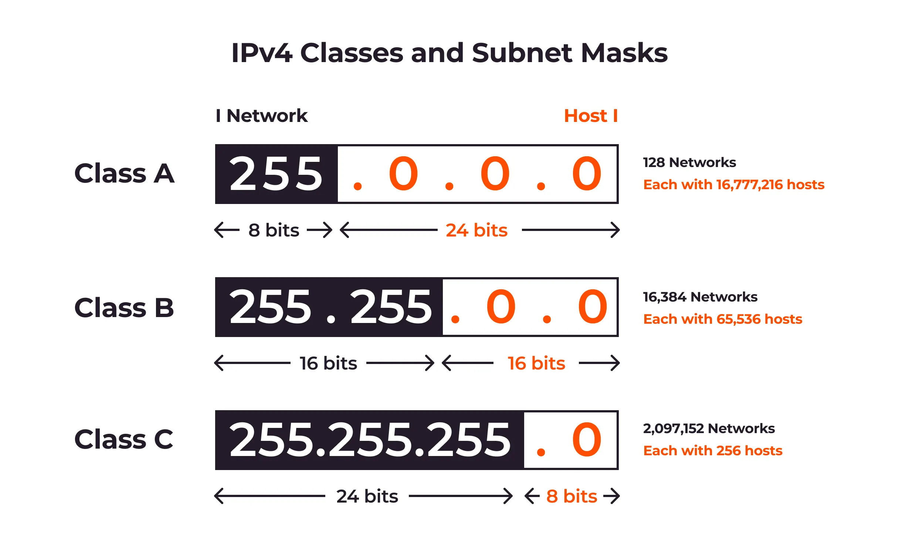

- **Subnetting**: The process of dividing a larger network into smaller, more manageable subnetworks. It helps improve network performance, organization, and security.
- **Subnet Mask**: A 32-bit number that separates the network and host portions of an IP address.

**Example**:
For the IP address `192.168.1.10` with a subnet mask `255.255.255.0`:
- The network portion is `192.168.1.0`.
- The host portion is `.10`.

**Benefits of Subnetting**:
- Efficient use of IP addresses.
- Reduced network congestion.
- Enhanced security by isolating subnets.

**CIDR Notation**:
Subnet masks can also be represented using Classless Inter-Domain Routing (CIDR) notation. For example, `/24` represents `255.255.255.0`.

**Subnetting Example**:
If you have a network `192.168.1.0/24`, splitting it into two subnets would result in:
- Subnet 1: `192.168.1.0/25` (hosts: `192.168.1.1` to `192.168.1.126`)
- Subnet 2: `192.168.1.128/25` (hosts: `192.168.1.129` to `192.168.1.254`)

  <b><a href="#top">↥ back to top</a></b>

---

### Levels

This section provides a breakdown of exercises and challenges to help apply networking concepts. Each level introduces new scenarios involving devices, IP configurations, and routing.

  
Level 1

   
  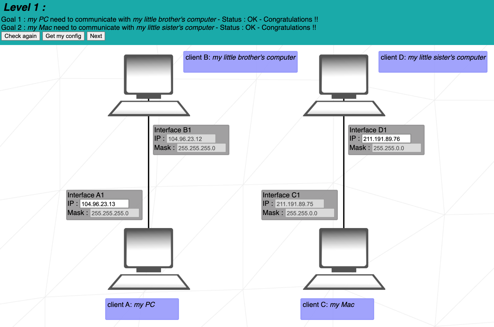

Client A and Client B share the same network, so their IP addresses must align with the network defined by the subnet mask. With a subnet mask of `255.255.255.0`, the first three bytes of the IP address identify the network, while the fourth byte specifies the host. As both devices are on the same network, only the host portion of their IP addresses can differ.
   
   

---

  
Level 2

   
  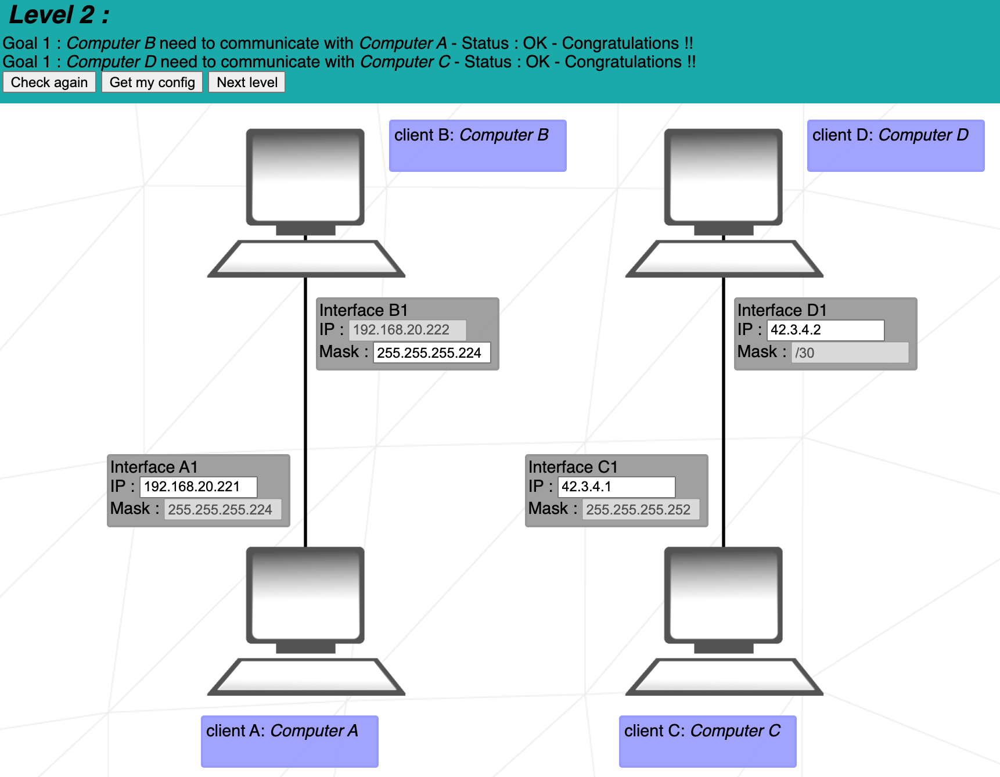  

  Clients C and D belong to another network and share a subnet mask of `/30`, which corresponds to `255.255.255.252`. This configuration allows for:

- The first 30 bits of their IP addresses to identify the same network.
- The last 2 bits to distinguish individual hosts within the network.

**Conditions for Valid IP Address Assignment**:
- The network portion (first 30 bits) must be identical for both Client C and Client D.
- The host portion (last 2 bits) cannot be all `1` (broadcast address) or all `0` (network address).
- Client C and Client D must have unique IP addresses within the network.
   
   

---

  
Level 3

   
  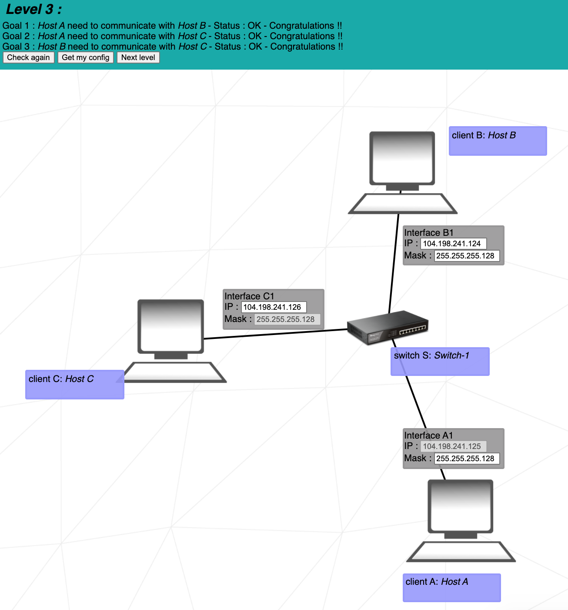  

  This exercise introduces the concept of a switch (referred to as Switch S in this example), which connects multiple hosts within the same network.

Client A, Client B, and Client C are all part of the same network and must therefore share the same subnet mask. Since Client C already uses the subnet mask `255.255.255.128` (or `/25` in CIDR notation), this mask will also be applied to Interface B1 and Interface A1.

The IP addresses assigned to Interface B1 and Interface C1 must fall within the same network range as Client A's IP address. This range is defined as `104.198.241.0 - 104.198.241.128`, excluding the network address and the broadcast address.

   
   

---

  
Level 4

   
  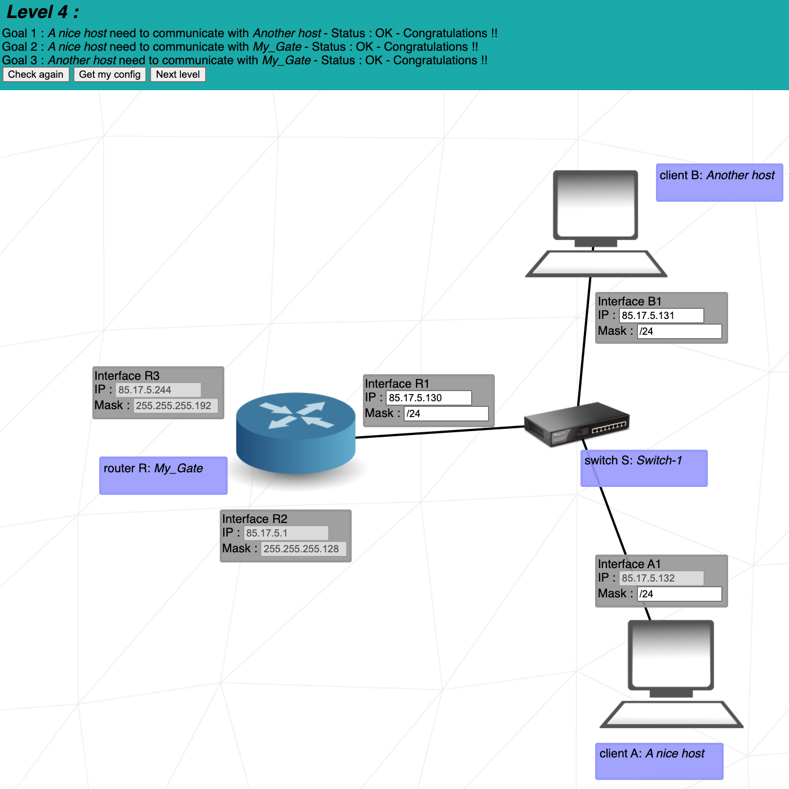  

  This exercise introduces the router,
Since no subnet masks are predefined for Interface B1, Interface A1, and Interface R1, we can select an appropriate subnet mask. A `/24` mask is ideal as it allocates the entire fourth byte for host addresses, simplifying address management without requiring complex binary calculations.
The IP addresses assigned to Interface B1 and Interface R1 must align with the network address of Interface A1. Using a /24 subnet, the valid address range is:

`85.17.5.0 - 85.17.5.255` As the network address and broadcast address must be excluded.
   
   

---

  
Level 5

   
  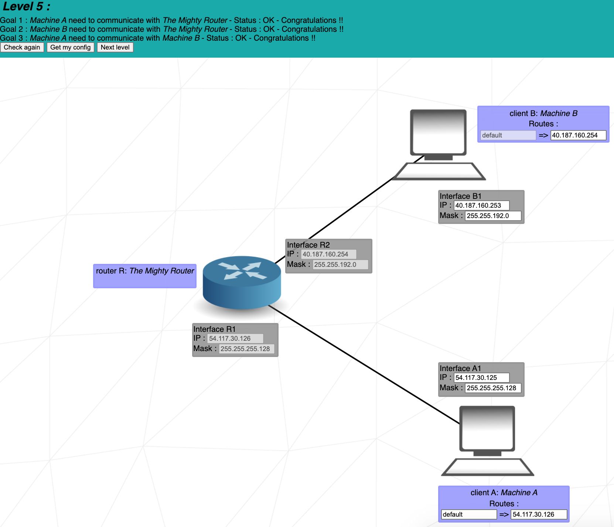  

  This level introduces the concept of routes, which consist of two key fields: the destination and the next hop.

The destination specifies where outbound packets are intended to go. The default destination, represented as `0.0.0.0/0`, routes packets to the first network address it encounters, regardless of the specific target. For example, a destination address of `122.3.5.3/24` directs packets to the `122.3.5.0` network.

The next hop is the IP address of the next router (or internet interface) where packets should be forwarded by the current machine.

Client A has only one available route for sending its packets, making it unnecessary to define a specific numbered destination. However, The next hop for Client A must be the IP address of Interface R1 `54.117.30.126` as it's the next router's interface along the route.

   
   

---

  
Level 6

   
  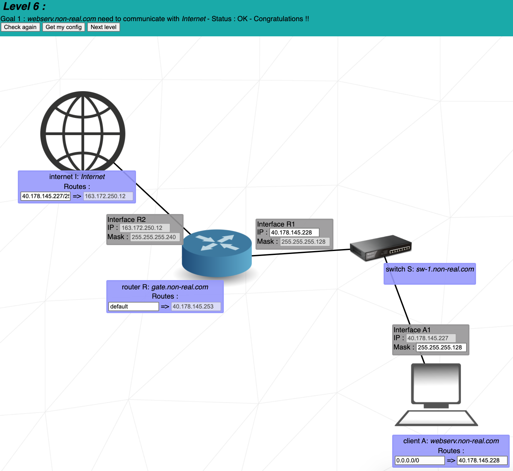 

  This level introduces the concept of the internet, that means no more private IP addresses.

  The next hop to reach the internet is already configured and corresponds to the IP address of Interface R2. Therefore, our focus should now be on determining the internet's destination which is The full network address:

`40.178.145.128`
With a range of `40.178.145.129 - 40.178.145.254` for its host addresses.
   
   

---

  
Level 7

   
  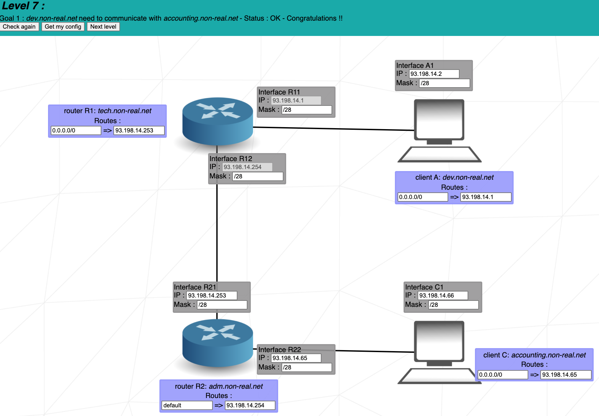  

  We have three separate networks, and the IP address range of each network must not overlap with that of another. This is known as "overlap." To achieve this, we need to divide the subnet into three or more distinct ranges by using a subnet mask that allows for such segmentation, such as a `/28` CIDR.

   
   

---

  
Level 8

   
  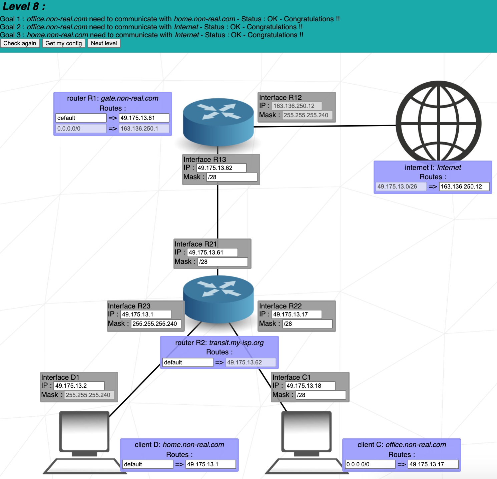  

1. Client C and Client D send packets to the internet, which responds by sending packets to the destination `49.175.13.0/26`. All receiving networks must fall within this range.

2. We use a `/28` mask on Interface R23 and R22 to divide the `/26` range into four non-overlapping subnets, one for each network:

- Router R1 to Router R2
- Router R2 to Client C
- Router R2 to Client D

The four subnets are:

- 49.175.13.0 - 49.175.13.15
- 49.175.13.16 - 49.175.13.31
- 49.175.13.32 - 49.175.13.47
- 49.175.13.48 - 49.175.13.63

Exclude the network and broadcast addresses from each range.

3. The destination and next hop for the internet are set. Only the next hop for Router R2, the IP on Interface R21, needs to be configured.
   
   

---

  
Level 9

   
  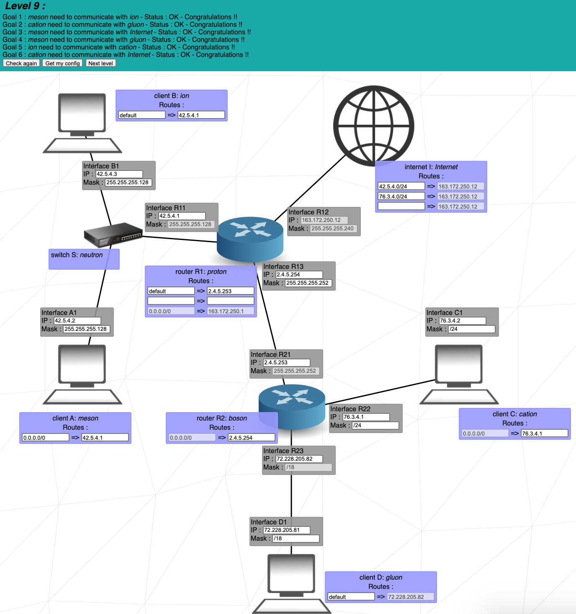  

  Since the internet doesn't initially send packets to a specific network, the separate networks don't need to share a common address range.

**Note:** It's fine to leave one destination in the internet's routing table and Router R1's destination empty. Not all routing table fields have to be filled.

   
   

---

  
Level 10

   
  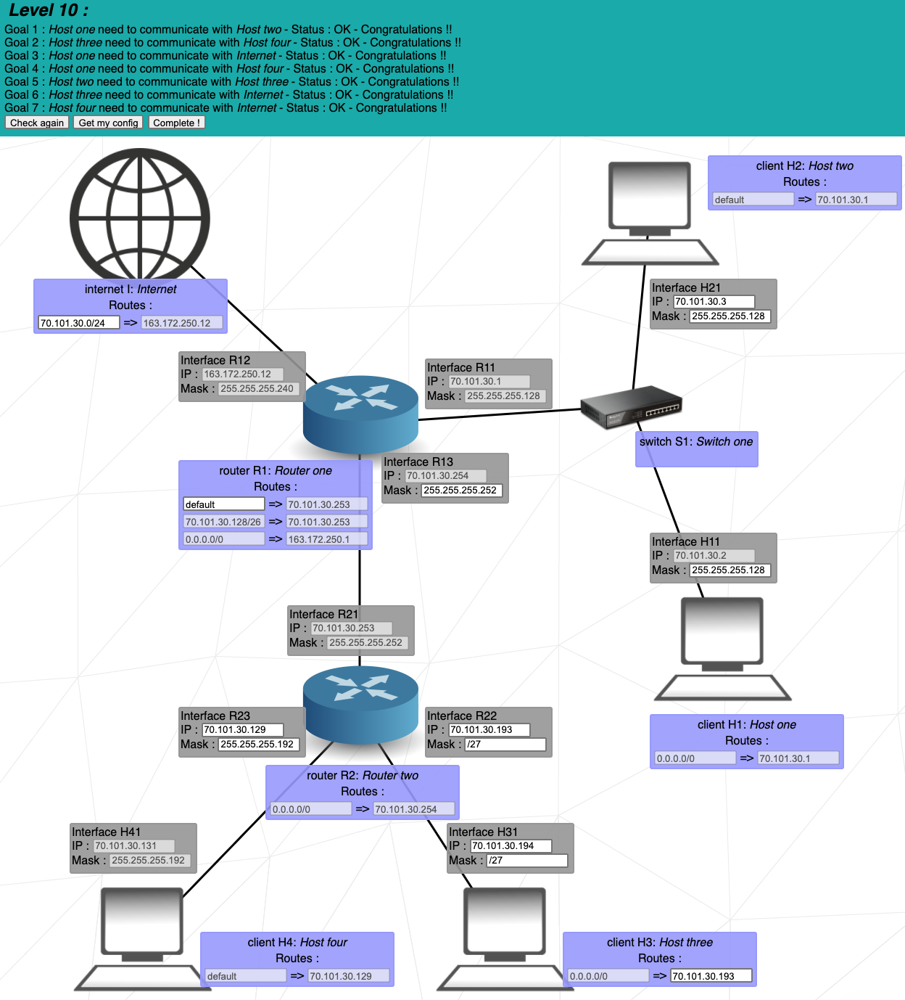  

1. The internet must be able to send packets to all hosts, so its destination must encompass the entire range of networks for all hosts.
2. It's important to ensure that the IP address range covered by the internet's destination does not overlap with other networks.

The remaining available IP addresses for the "Router R2 to Client H3" network are `70.101.30.192 - 70.101.30.251`. We can choose a subnet mask that allows us to allocate 2 IP addresses from this range for Interface R22 and Interface R31.
   
   

